Clustering and PCA

In this part, firstly I have tried pca to see if it could distinguish the color and quality. The result is displayed below. We could see that the distribution of color is clear but the quality is a mass. 

    Importance of components:
                              PC1    PC2    PC3     PC4     PC5     PC6     PC7
    Standard deviation     1.7407 1.5792 1.2475 0.98517 0.84845 0.77930 0.72330
    Proportion of Variance 0.2754 0.2267 0.1415 0.08823 0.06544 0.05521 0.04756
    Cumulative Proportion  0.2754 0.5021 0.6436 0.73187 0.79732 0.85253 0.90009
                               PC8     PC9   PC10    PC11
    Standard deviation     0.70817 0.58054 0.4772 0.18119
    Proportion of Variance 0.04559 0.03064 0.0207 0.00298
    Cumulative Proportion  0.94568 0.97632 0.9970 1.00000

    
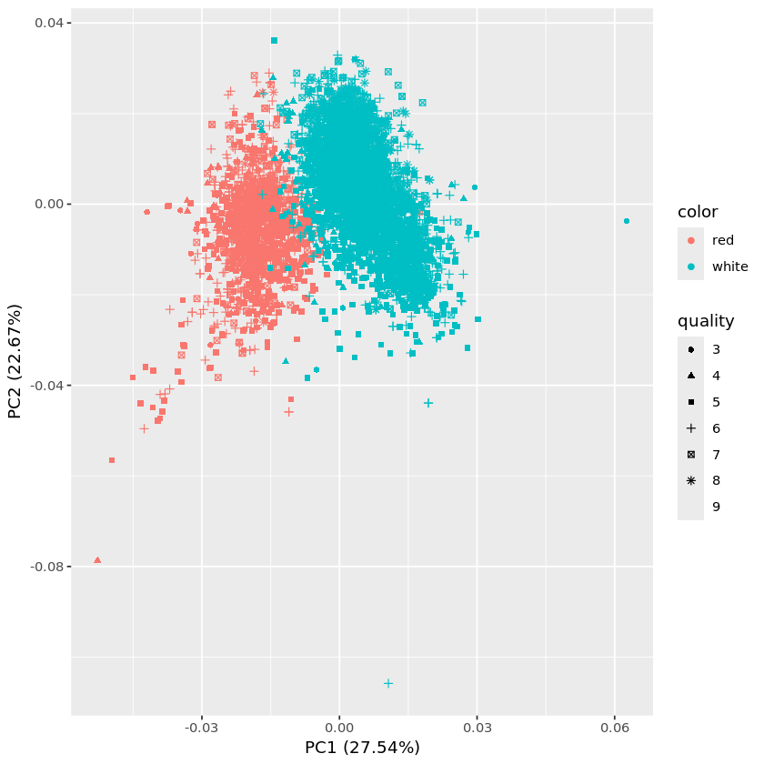
    

Thus I try to only plot the distribution of quality. The plot is followed. From this plot we could see that pca may could distinguish the quality level but the graph could be a mass.

    
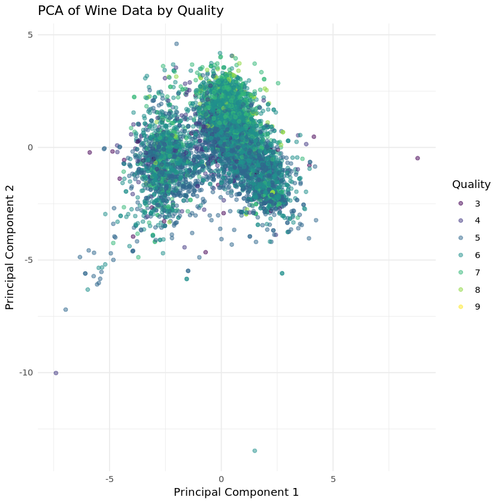
    

Optimal number of clusters seems useless. 

    
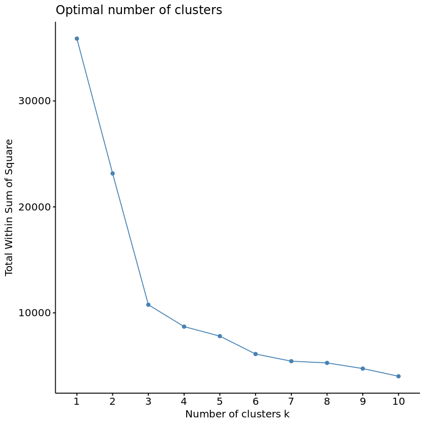
    

Then I tried kmeans as comparison. I set the centers to 7, aiming to detect the 7 quality levels. The result is followed. We could see that the kmeans is not capable to distinguish the quality level.

    
    
    Table: Summary of Wine Quality by Cluster
    
    | cluster| Average_Quality| Min_Quality| Max_Quality| Count|
    |-------:|---------------:|-----------:|-----------:|-----:|
    |       3|        6.325269|           3|           9|  1116|
    |       1|        6.135708|           4|           8|  1179|
    |       6|        5.671413|           3|           8|   913|
    |       5|        5.654867|           3|           8|   791|
    |       2|        5.634826|           3|           9|  1005|
    |       7|        5.543478|           3|           8|   598|
    |       4|        5.452514|           3|           8|   895|

    
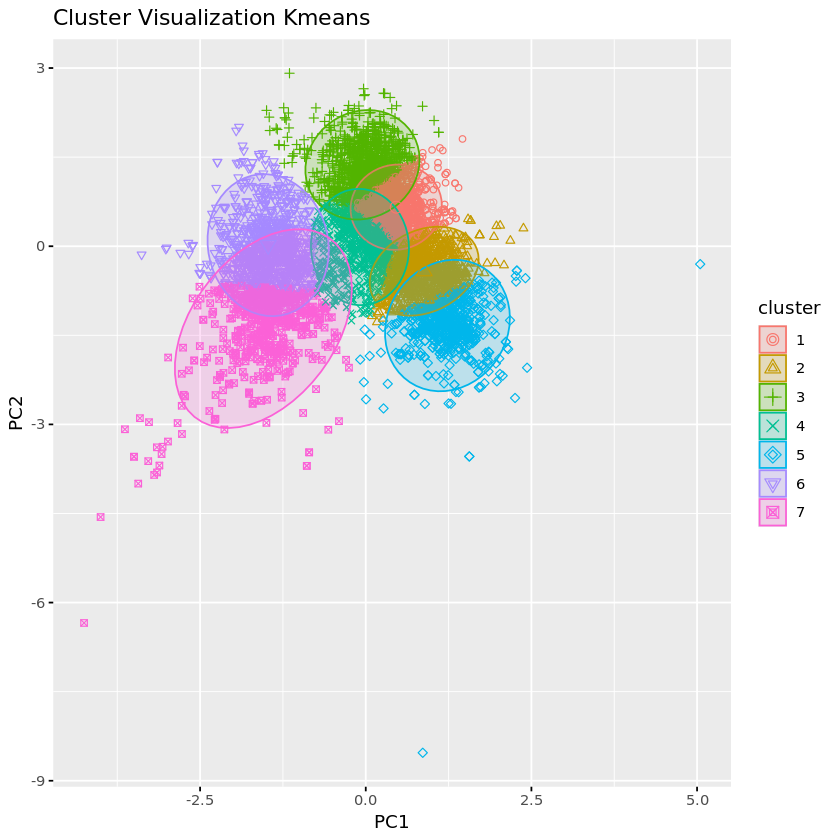
    

But kmeans coud clearly distinguish the color of wine as displayed below setting centers to 2.

    
    
    Table: Summary of Wine Quality by Cluster
    
    | cluster| Average_Quality| Min_Quality| Max_Quality| Count|
    |-------:|---------------:|-----------:|-----------:|-----:|
    |       1|        5.891965|           3|           9|  4841|
    |       2|        5.603261|           3|           8|  1656|

    
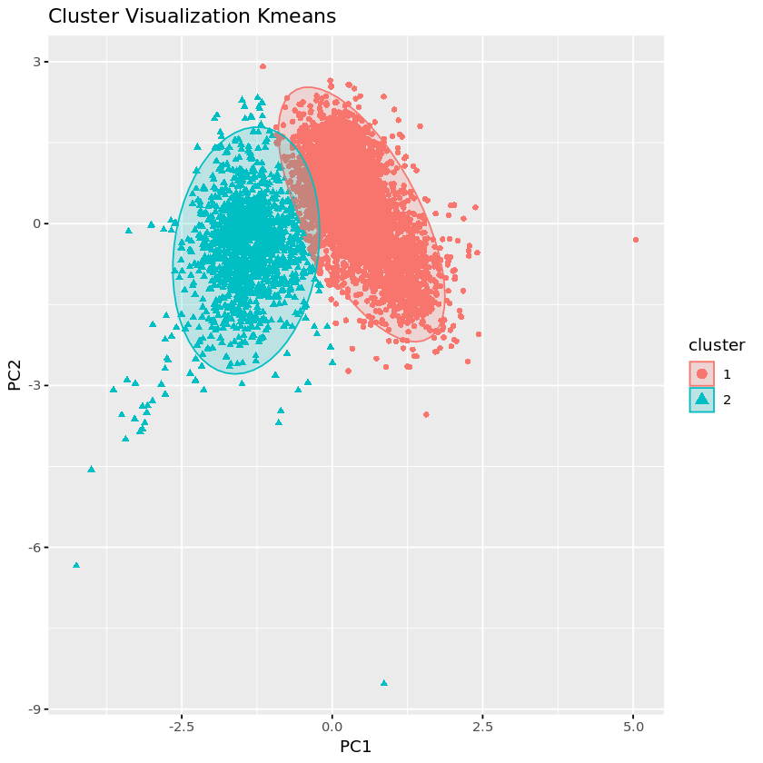
    

Market segmentation

In this part, firstly I use pca to finish the market segmentation mission. First I check for the scale dimensions. We could see that the highest percentage of explained variance just beyond 12, which is low.

    
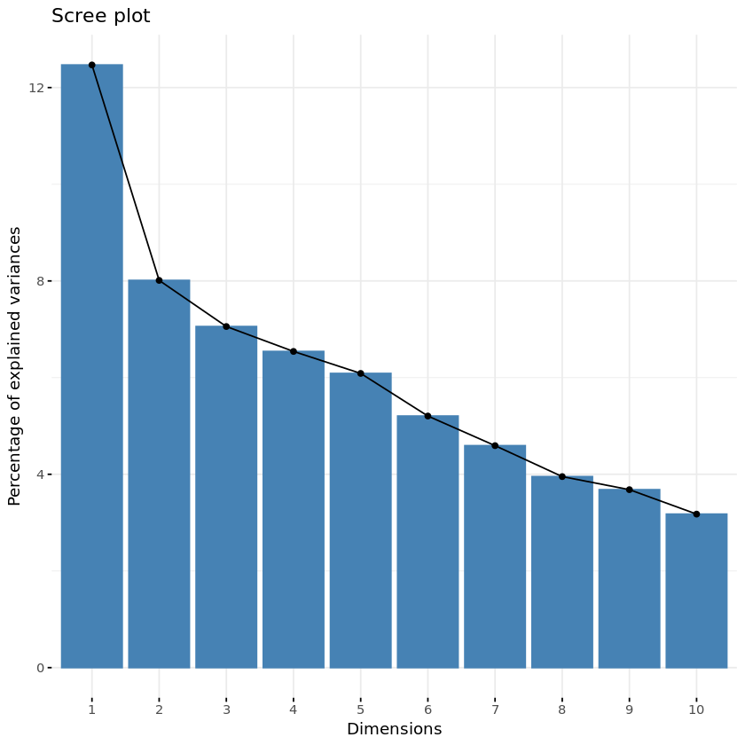
    

Then applying kmeans to detect the optimal dimensions. The result is followed. Seems like 5 dimensions could be the optimal number.

    
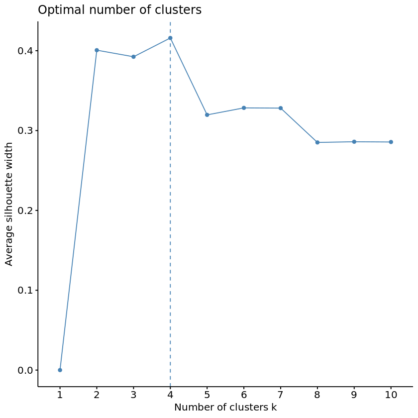
    

Then calculate the distribution of variables in each cluster. The whole table looks complex then I calculate the top 5 variables in each column.

    
    
    Table: Cluster Summary with Main Favorites
    
    | Cluster | chatter  | current_events |  travel  | photo_sharing | uncategorized |  tv_film  | sports_fandom | politics  |   food   |  family   | home_and_garden |   music   |   news    | online_gaming | shopping  | health_nutrition | college_uni | sports_playing |  cooking  |    eco    | computers | business  | outdoors  |  crafts   | automotive |    art    | religion  |  beauty   | parenting |  dating   |  school   | personal_fitness |  fashion  | small_business |   spam    |   adult   | cluster | Main_Favorite |
    |:-------:|:--------:|:--------------:|:--------:|:-------------:|:-------------:|:---------:|:-------------:|:---------:|:--------:|:---------:|:---------------:|:---------:|:---------:|:-------------:|:---------:|:----------------:|:-----------:|:--------------:|:---------:|:---------:|:---------:|:---------:|:---------:|:---------:|:----------:|:---------:|:---------:|:---------:|:---------:|:---------:|:---------:|:----------------:|:---------:|:--------------:|:---------:|:---------:|:-------:|:-------------:|
    |    1    | 4.744615 |    1.726154    | 6.010769 |   2.640000    |   0.7800000   | 1.3615385 |   1.9584615   | 9.1246154 | 1.489231 | 0.9984615 |    0.6415385    | 0.6569231 | 5.0446154 |   1.5184615   | 1.5046154 |     1.563077     |  2.040000   |   0.7923077    | 1.2046154 | 0.6338462 | 2.6584615 | 0.7030769 | 0.8538462 | 0.6892308 | 2.2215385  | 0.9046154 | 1.0815385 | 0.4692308 | 0.9784615 | 1.0446154 | 0.7276923 |    0.9569231     | 0.6415385 |   0.5415385    | 0.0107692 | 0.3400000 |    1    |   politics    |
    |    2    | 6.666199 |    1.959327    | 1.530154 |   6.221599    |   1.3800842   | 1.6199158 |   1.4193548   | 1.5624123 | 1.833100 | 1.0645161 |    0.8218794    | 1.4431978 | 1.1767181 |   2.0673212   | 2.7643759 |     7.064516     |  2.781206   |   1.2019635    | 8.1809257 | 0.9719495 | 0.7868163 | 0.7713885 | 1.8793829 | 0.8681627 | 0.9887798  | 1.2187938 | 1.0280505 | 2.7026648 | 0.9747546 | 1.4908836 | 1.0953717 |    3.9102384     | 4.0350631 |   0.6143058    | 0.0042076 | 0.4488079 |    2    |    cooking    |
    |    3    | 3.914894 |    1.668883    | 1.283245 |   2.360372    |   0.7513298   | 1.0412234 |   5.9813830   | 1.1529255 | 4.623670 | 2.5305851 |    0.6569149    | 0.7101064 | 1.0718085 |   1.2686170   | 1.3071809 |     2.344415     |  1.422872   |   0.7699468    | 1.6502660 | 0.6529255 | 0.7207447 | 0.4840426 | 0.8018617 | 1.0744681 | 1.0731383  | 0.8843085 | 5.3510638 | 1.0664894 | 4.0890957 | 0.7061170 | 2.7247340 |    1.4667553     | 0.9920213 |   0.3962766    | 0.0093085 | 0.4348404 |    3    | sports_fandom |
    |    4    | 3.192805 |    1.268128    | 1.033727 |   1.509275    |   0.6065205   | 0.7310287 |   0.9286116   | 0.9881956 | 0.732434 | 0.5281057 |    0.3726813    | 0.3979764 | 0.7419899 |   0.7498595   | 0.7661608 |     1.191400     |  0.915683   |   0.3799888    | 0.6765037 | 0.2996065 | 0.3223721 | 0.2363687 | 0.4058460 | 0.2681282 | 0.5297920  | 0.4072513 | 0.4828555 | 0.2523890 | 0.4221473 | 0.3288364 | 0.3546936 |    0.6812816     | 0.3353007 |   0.1899944    | 0.0056211 | 0.3560989 |    4    |    cluster    |
    |    5    | 5.672250 |    1.694885    | 1.291082 |   3.602988    |   0.9932096   | 1.3635129 |   1.1213219   | 1.2086917 | 1.202807 | 0.7329108 |    0.5799004    | 0.8818470 | 0.8773201 |   1.5595292   | 1.9434133 |     3.703033     |  2.071526   |   0.7854233    | 2.4834767 | 0.6229063 | 0.5151652 | 0.5088275 | 1.0081485 | 0.5599819 | 0.7695790  | 0.9696695 | 0.6591218 | 0.7360797 | 0.6129470 | 0.9778180 | 0.6727026 |    2.0765052     | 1.1869624 |   0.4015392    | 0.0063377 | 0.4726120 |    5    |    chatter    |

Based on this simplified table, I named the 5 clusters from the top to bottom as "looks serious", "looks healthy", "third cluster third", "kind of similar to first", and "similar to second". I think NutrientH20 could make policy to attract both the "looks serious" group and "looks healthy" group for there are two other groups similar to these clusters. 

    
    
    Table: Top Five Favorites in Each Cluster
    
    |                             Top5_Favorites                              |
    |:-----------------------------------------------------------------------:|
    |            politics, travel, news, computers, photo_sharing             |
    |   cooking, health_nutrition, photo_sharing, fashion, personal_fitness   |
    |            sports_fandom, religion, food, parenting, school             |
    |    photo_sharing, current_events, health_nutrition, travel, politics    |
    | health_nutrition, photo_sharing, cooking, personal_fitness, college_uni |

Association rules for grocery purchases

In this part, firstly I set support_threshold = 0.01
confidence_threshold = 0.1
lift_threshold = 0, just give it a random try. 

    Apriori
    
    Parameter specification:
     confidence minval smax arem  aval originalSupport maxtime support minlen
            0.1    0.1    1 none FALSE            TRUE       5    0.01      1
     maxlen target  ext
          4  rules TRUE
    
    Algorithmic control:
     filter tree heap memopt load sort verbose
        0.1 TRUE TRUE  FALSE TRUE    2    TRUE
    
    Absolute minimum support count: 98 
    
    set item appearances ...[0 item(s)] done [0.00s].
    set transactions ...[169 item(s), 9835 transaction(s)] done [0.00s].
    sorting and recoding items ... [88 item(s)] done [0.00s].
    creating transaction tree ... done [0.00s].
    checking subsets of size 1 2 3 4 done [0.00s].
    writing ... [435 rule(s)] done [0.00s].
    creating S4 object  ... done [0.00s].

This plot contains a lot of information but useless for us to find some interesting insights. 

    
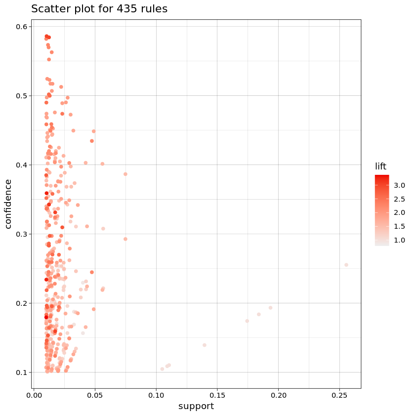
    

Complex graph, it's hard to directly gain the relationship from the graph.

    
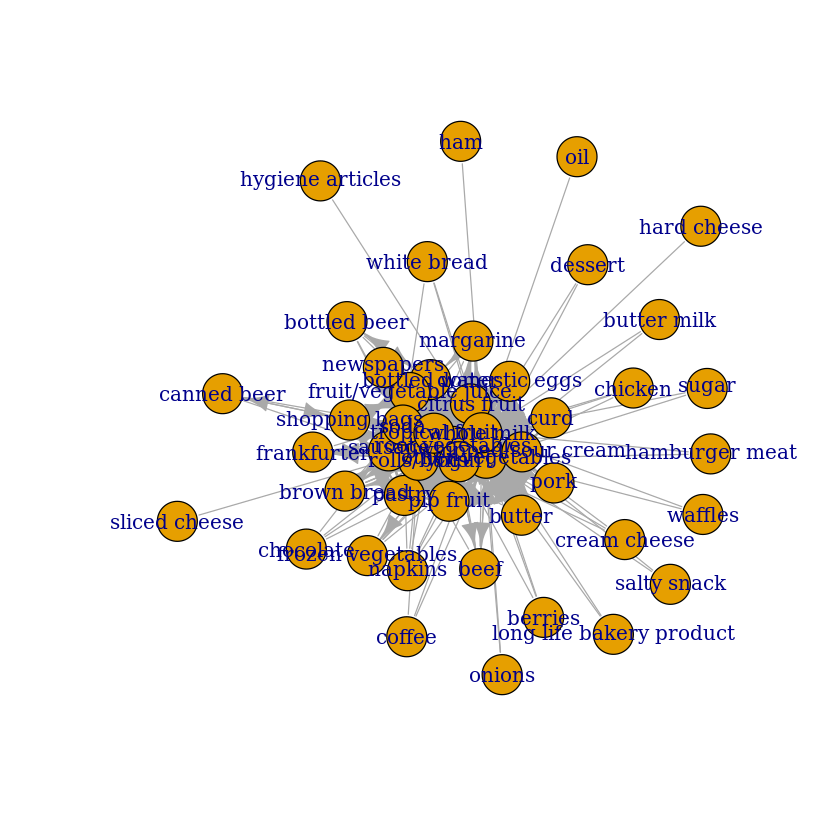
    

Then I choose higher lift_threshold = 2, keep the others constant.

    Apriori
    
    Parameter specification:
     confidence minval smax arem  aval originalSupport maxtime support minlen
            0.1    0.1    1 none FALSE            TRUE       5    0.01      1
     maxlen target  ext
          4  rules TRUE
    
    Algorithmic control:
     filter tree heap memopt load sort verbose
        0.1 TRUE TRUE  FALSE TRUE    2    TRUE
    
    Absolute minimum support count: 98 
    
    set item appearances ...[0 item(s)] done [0.00s].
    set transactions ...[169 item(s), 9835 transaction(s)] done [0.00s].
    sorting and recoding items ... [88 item(s)] done [0.00s].
    creating transaction tree ... done [0.00s].
    checking subsets of size 1 2 3 4 done [0.00s].
    writing ... [435 rule(s)] done [0.00s].
    creating S4 object  ... done [0.00s].

This time the plot contains less information. Then visualize the result of estimation. 

    To reduce overplotting, jitter is added! Use jitter = 0 to prevent jitter.
    

    
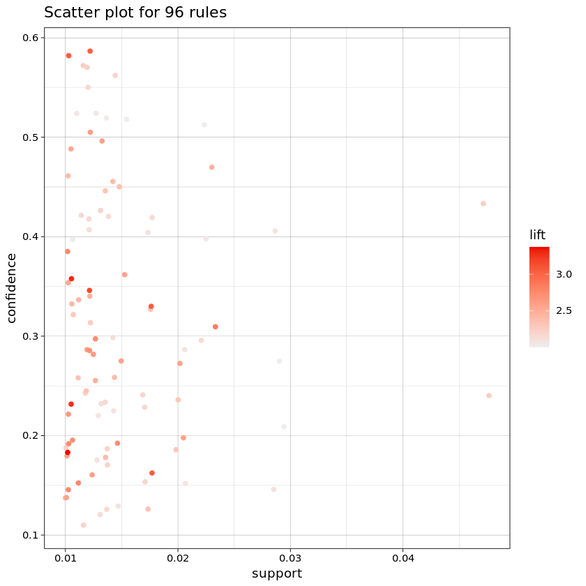
    

It's better but still not that clear.

    
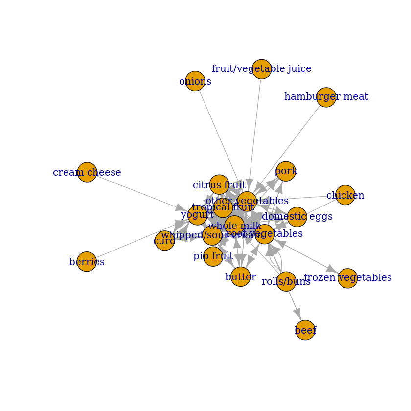
    

         lhs                         rhs                     support confidence   coverage     lift count
    [1]  {onions}                 => {other vegetables}   0.01423488  0.4590164 0.03101169 2.372268   140
    [2]  {berries}                => {yogurt}             0.01057448  0.3180428 0.03324860 2.279848   104
    [3]  {hamburger meat}         => {other vegetables}   0.01382816  0.4159021 0.03324860 2.149447   136
    [4]  {cream cheese}           => {yogurt}             0.01240468  0.3128205 0.03965430 2.242412   122
    [5]  {chicken}                => {root vegetables}    0.01087951  0.2535545 0.04290798 2.326221   107
    [6]  {chicken}                => {other vegetables}   0.01789527  0.4170616 0.04290798 2.155439   176
    [7]  {frozen vegetables}      => {root vegetables}    0.01159126  0.2410148 0.04809354 2.211176   114
    [8]  {root vegetables}        => {frozen vegetables}  0.01159126  0.1063433 0.10899847 2.211176   114
    [9]  {beef}                   => {root vegetables}    0.01738688  0.3313953 0.05246568 3.040367   171
    [10] {root vegetables}        => {beef}               0.01738688  0.1595149 0.10899847 3.040367   171
    [11] {curd}                   => {whipped/sour cream} 0.01047280  0.1965649 0.05327911 2.742150   103
    [12] {whipped/sour cream}     => {curd}               0.01047280  0.1460993 0.07168277 2.742150   103
    [13] {curd}                   => {yogurt}             0.01728521  0.3244275 0.05327911 2.325615   170
    [14] {yogurt}                 => {curd}               0.01728521  0.1239067 0.13950178 2.325615   170
    [15] {pork}                   => {root vegetables}    0.01362481  0.2363316 0.05765125 2.168210   134
    [16] {root vegetables}        => {pork}               0.01362481  0.1250000 0.10899847 2.168210   134
    [17] {butter}                 => {whipped/sour cream} 0.01016777  0.1834862 0.05541434 2.559698   100
    [18] {whipped/sour cream}     => {butter}             0.01016777  0.1418440 0.07168277 2.559698   100
    [19] {butter}                 => {root vegetables}    0.01291307  0.2330275 0.05541434 2.137897   127
    [20] {root vegetables}        => {butter}             0.01291307  0.1184701 0.10899847 2.137897   127
    [21] {domestic eggs}          => {root vegetables}    0.01433655  0.2259615 0.06344687 2.073071   141
    [22] {root vegetables}        => {domestic eggs}      0.01433655  0.1315299 0.10899847 2.073071   141
    [23] {whipped/sour cream}     => {root vegetables}    0.01708185  0.2382979 0.07168277 2.186250   168
    [24] {root vegetables}        => {whipped/sour cream} 0.01708185  0.1567164 0.10899847 2.186250   168
    [25] {whipped/sour cream}     => {yogurt}             0.02074225  0.2893617 0.07168277 2.074251   204
    [26] {yogurt}                 => {whipped/sour cream} 0.02074225  0.1486880 0.13950178 2.074251   204
    [27] {whipped/sour cream}     => {other vegetables}   0.02887646  0.4028369 0.07168277 2.081924   284
    [28] {other vegetables}       => {whipped/sour cream} 0.02887646  0.1492380 0.19349263 2.081924   284
    [29] {pip fruit}              => {citrus fruit}       0.01382816  0.1827957 0.07564820 2.208594   136
    [30] {citrus fruit}           => {pip fruit}          0.01382816  0.1670762 0.08276563 2.208594   136
    [31] {pip fruit}              => {tropical fruit}     0.02043721  0.2701613 0.07564820 2.574648   201
    [32] {tropical fruit}         => {pip fruit}          0.02043721  0.1947674 0.10493137 2.574648   201
    [33] {citrus fruit}           => {tropical fruit}     0.01992883  0.2407862 0.08276563 2.294702   196
    [34] {tropical fruit}         => {citrus fruit}       0.01992883  0.1899225 0.10493137 2.294702   196
    [35] {tropical fruit}         => {yogurt}             0.02928317  0.2790698 0.10493137 2.000475   288
    [36] {yogurt}                 => {tropical fruit}     0.02928317  0.2099125 0.13950178 2.000475   288
    [37] {root vegetables}        => {other vegetables}   0.04738180  0.4347015 0.10899847 2.246605   466
    [38] {other vegetables}       => {root vegetables}    0.04738180  0.2448765 0.19349263 2.246605   466
    [39] {curd,                                                                                          
          yogurt}                 => {whole milk}         0.01006609  0.5823529 0.01728521 2.279125    99
    [40] {curd,                                                                                          
          whole milk}             => {yogurt}             0.01006609  0.3852140 0.02613116 2.761356    99
    [41] {whole milk,                                                                                    
          yogurt}                 => {curd}               0.01006609  0.1796733 0.05602440 3.372304    99
    [42] {pork,                                                                                          
          whole milk}             => {other vegetables}   0.01016777  0.4587156 0.02216573 2.370714   100
    [43] {other vegetables,                                                                              
          whole milk}             => {pork}               0.01016777  0.1358696 0.07483477 2.356750   100
    [44] {butter,                                                                                        
          other vegetables}       => {whole milk}         0.01148958  0.5736041 0.02003050 2.244885   113
    [45] {butter,                                                                                        
          whole milk}             => {other vegetables}   0.01148958  0.4169742 0.02755465 2.154987   113
    [46] {other vegetables,                                                                              
          whole milk}             => {butter}             0.01148958  0.1535326 0.07483477 2.770630   113
    [47] {domestic eggs,                                                                                 
          other vegetables}       => {whole milk}         0.01230300  0.5525114 0.02226741 2.162336   121
    [48] {domestic eggs,                                                                                 
          whole milk}             => {other vegetables}   0.01230300  0.4101695 0.02999492 2.119820   121
    [49] {other vegetables,                                                                              
          whole milk}             => {domestic eggs}      0.01230300  0.1644022 0.07483477 2.591178   121
    [50] {fruit/vegetable juice,                                                                         
          whole milk}             => {other vegetables}   0.01047280  0.3931298 0.02663955 2.031756   103
    [51] {whipped/sour cream,                                                                            
          yogurt}                 => {other vegetables}   0.01016777  0.4901961 0.02074225 2.533410   100
    [52] {other vegetables,                                                                              
          whipped/sour cream}     => {yogurt}             0.01016777  0.3521127 0.02887646 2.524073   100
    [53] {other vegetables,                                                                              
          yogurt}                 => {whipped/sour cream} 0.01016777  0.2341920 0.04341637 3.267062   100
    [54] {whipped/sour cream,                                                                            
          yogurt}                 => {whole milk}         0.01087951  0.5245098 0.02074225 2.052747   107
    [55] {whipped/sour cream,                                                                            
          whole milk}             => {yogurt}             0.01087951  0.3375394 0.03223183 2.419607   107
    [56] {whole milk,                                                                                    
          yogurt}                 => {whipped/sour cream} 0.01087951  0.1941924 0.05602440 2.709053   107
    [57] {whipped/sour cream,                                                                            
          whole milk}             => {other vegetables}   0.01464159  0.4542587 0.03223183 2.347679   144
    [58] {other vegetables,                                                                              
          whole milk}             => {whipped/sour cream} 0.01464159  0.1956522 0.07483477 2.729417   144
    [59] {other vegetables,                                                                              
          pip fruit}              => {whole milk}         0.01352313  0.5175097 0.02613116 2.025351   133
    [60] {pip fruit,                                                                                     
          whole milk}             => {other vegetables}   0.01352313  0.4493243 0.03009659 2.322178   133
    [61] {other vegetables,                                                                              
          whole milk}             => {pip fruit}          0.01352313  0.1807065 0.07483477 2.388775   133
    [62] {citrus fruit,                                                                                  
          root vegetables}        => {other vegetables}   0.01037112  0.5862069 0.01769192 3.029608   102
    [63] {citrus fruit,                                                                                  
          other vegetables}       => {root vegetables}    0.01037112  0.3591549 0.02887646 3.295045   102
    [64] {other vegetables,                                                                              
          root vegetables}        => {citrus fruit}       0.01037112  0.2188841 0.04738180 2.644626   102
    [65] {citrus fruit,                                                                                  
          whole milk}             => {yogurt}             0.01026945  0.3366667 0.03050330 2.413350   101
    [66] {whole milk,                                                                                    
          yogurt}                 => {citrus fruit}       0.01026945  0.1833031 0.05602440 2.214725   101
    [67] {citrus fruit,                                                                                  
          whole milk}             => {other vegetables}   0.01301474  0.4266667 0.03050330 2.205080   128
    [68] {other vegetables,                                                                              
          whole milk}             => {citrus fruit}       0.01301474  0.1739130 0.07483477 2.101271   128
    [69] {root vegetables,                                                                               
          tropical fruit}         => {other vegetables}   0.01230300  0.5845411 0.02104728 3.020999   121
    [70] {other vegetables,                                                                              
          tropical fruit}         => {root vegetables}    0.01230300  0.3427762 0.03589222 3.144780   121
    [71] {other vegetables,                                                                              
          root vegetables}        => {tropical fruit}     0.01230300  0.2596567 0.04738180 2.474538   121
    [72] {root vegetables,                                                                               
          tropical fruit}         => {whole milk}         0.01199797  0.5700483 0.02104728 2.230969   118
    [73] {tropical fruit,                                                                                
          whole milk}             => {root vegetables}    0.01199797  0.2836538 0.04229792 2.602365   118
    [74] {root vegetables,                                                                               
          whole milk}             => {tropical fruit}     0.01199797  0.2453222 0.04890696 2.337931   118
    [75] {tropical fruit,                                                                                
          yogurt}                 => {other vegetables}   0.01230300  0.4201389 0.02928317 2.171343   121
    [76] {other vegetables,                                                                              
          tropical fruit}         => {yogurt}             0.01230300  0.3427762 0.03589222 2.457146   121
    [77] {other vegetables,                                                                              
          yogurt}                 => {tropical fruit}     0.01230300  0.2833724 0.04341637 2.700550   121
    [78] {tropical fruit,                                                                                
          yogurt}                 => {whole milk}         0.01514997  0.5173611 0.02928317 2.024770   149
    [79] {tropical fruit,                                                                                
          whole milk}             => {yogurt}             0.01514997  0.3581731 0.04229792 2.567516   149
    [80] {whole milk,                                                                                    
          yogurt}                 => {tropical fruit}     0.01514997  0.2704174 0.05602440 2.577089   149
    [81] {tropical fruit,                                                                                
          whole milk}             => {other vegetables}   0.01708185  0.4038462 0.04229792 2.087140   168
    [82] {other vegetables,                                                                              
          whole milk}             => {tropical fruit}     0.01708185  0.2282609 0.07483477 2.175335   168
    [83] {root vegetables,                                                                               
          yogurt}                 => {other vegetables}   0.01291307  0.5000000 0.02582613 2.584078   127
    [84] {other vegetables,                                                                              
          yogurt}                 => {root vegetables}    0.01291307  0.2974239 0.04341637 2.728698   127
    [85] {root vegetables,                                                                               
          yogurt}                 => {whole milk}         0.01453991  0.5629921 0.02582613 2.203354   143
    [86] {root vegetables,                                                                               
          whole milk}             => {yogurt}             0.01453991  0.2972973 0.04890696 2.131136   143
    [87] {whole milk,                                                                                    
          yogurt}                 => {root vegetables}    0.01453991  0.2595281 0.05602440 2.381025   143
    [88] {rolls/buns,                                                                                    
          root vegetables}        => {other vegetables}   0.01220132  0.5020921 0.02430097 2.594890   120
    [89] {other vegetables,                                                                              
          rolls/buns}             => {root vegetables}    0.01220132  0.2863962 0.04260295 2.627525   120
    [90] {rolls/buns,                                                                                    
          root vegetables}        => {whole milk}         0.01270971  0.5230126 0.02430097 2.046888   125
    [91] {rolls/buns,                                                                                    
          whole milk}             => {root vegetables}    0.01270971  0.2244165 0.05663447 2.058896   125
    [92] {root vegetables,                                                                               
          whole milk}             => {other vegetables}   0.02318251  0.4740125 0.04890696 2.449770   228
    [93] {other vegetables,                                                                              
          whole milk}             => {root vegetables}    0.02318251  0.3097826 0.07483477 2.842082   228
    [94] {other vegetables,                                                                              
          yogurt}                 => {whole milk}         0.02226741  0.5128806 0.04341637 2.007235   219
    [95] {whole milk,                                                                                    
          yogurt}                 => {other vegetables}   0.02226741  0.3974592 0.05602440 2.054131   219
    [96] {other vegetables,                                                                              
          whole milk}             => {yogurt}             0.02226741  0.2975543 0.07483477 2.132979   219

This time I set lift_threshold = 3 aiming to detect more specific relationships in the shopping baskets.

    Apriori
    
    Parameter specification:
     confidence minval smax arem  aval originalSupport maxtime support minlen
            0.1    0.1    1 none FALSE            TRUE       5    0.01      1
     maxlen target  ext
          4  rules TRUE
    
    Algorithmic control:
     filter tree heap memopt load sort verbose
        0.1 TRUE TRUE  FALSE TRUE    2    TRUE
    
    Absolute minimum support count: 98 
    
    set item appearances ...[0 item(s)] done [0.00s].
    set transactions ...[169 item(s), 9835 transaction(s)] done [0.00s].
    sorting and recoding items ... [88 item(s)] done [0.00s].
    creating transaction tree ... done [0.00s].
    checking subsets of size 1 2 3 4 done [0.00s].
    writing ... [435 rule(s)] done [0.00s].
    creating S4 object  ... done [0.00s].

The plot looks clear now. Visualize them. 

    
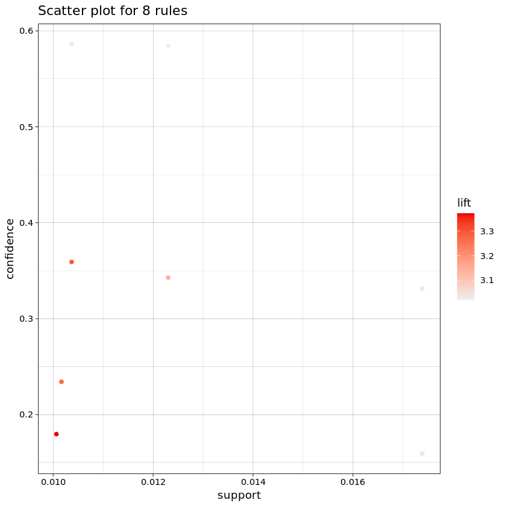
    

We could gain direct information from the graph now. Check for the table for details.

    
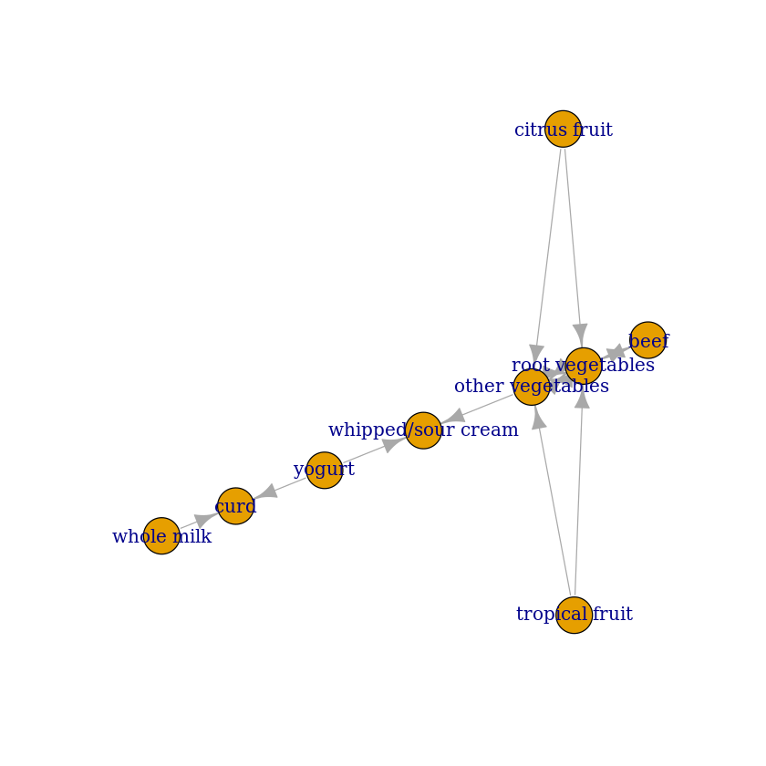
    

        lhs                                   rhs                  support   
    [1] {beef}                             => {root vegetables}    0.01738688
    [2] {root vegetables}                  => {beef}               0.01738688
    [3] {whole milk, yogurt}               => {curd}               0.01006609
    [4] {other vegetables, yogurt}         => {whipped/sour cream} 0.01016777
    [5] {citrus fruit, root vegetables}    => {other vegetables}   0.01037112
    [6] {citrus fruit, other vegetables}   => {root vegetables}    0.01037112
    [7] {root vegetables, tropical fruit}  => {other vegetables}   0.01230300
    [8] {other vegetables, tropical fruit} => {root vegetables}    0.01230300
        confidence coverage   lift     count
    [1] 0.3313953  0.05246568 3.040367 171  
    [2] 0.1595149  0.10899847 3.040367 171  
    [3] 0.1796733  0.05602440 3.372304  99  
    [4] 0.2341920  0.04341637 3.267062 100  
    [5] 0.5862069  0.01769192 3.029608 102  
    [6] 0.3591549  0.02887646 3.295045 102  
    [7] 0.5845411  0.02104728 3.020999 121  
    [8] 0.3427762  0.03589222 3.144780 121  

From the detailed table, we could see that people with beef in barket have higher possibility to buy root vegetables but lower possibility in opposite. I guess that's because if people want to eat beef then they would buy beef firstly then choose root vegetables as side dish. But if people buy root vegetables in advance they may just want to eat some vegetables.  

Image classification with neural networks

In this part I have built a neural network using an 80/20 train test split. I trained a three neural model and calculate the accuracy of estimation by setting a calculating function.

    Accuracy of the network on test images: 82 %

    
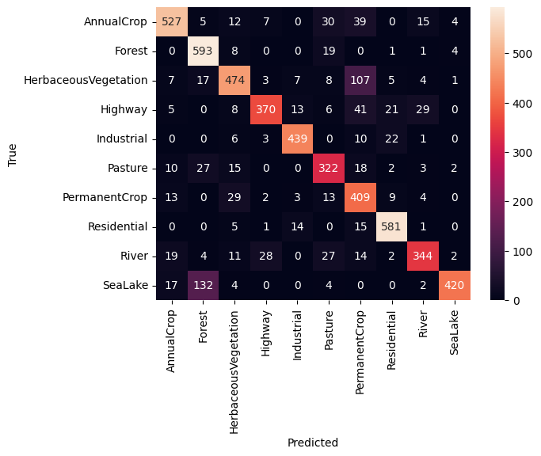
    

From the confusion matrix above, we could know the performance of the model on the set test

Below is the example of my model's prediction. 

    
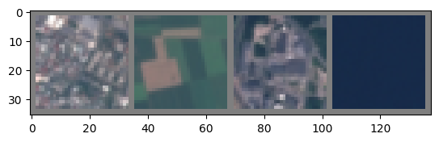
    

    Predicted: Residential AnnualCrop Industrial SeaLake
    Actual: Residential AnnualCrop Industrial SeaLake

